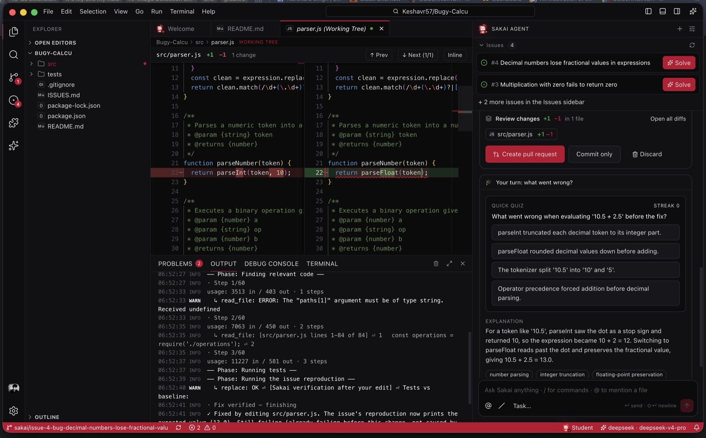
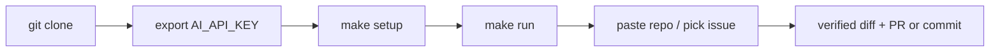
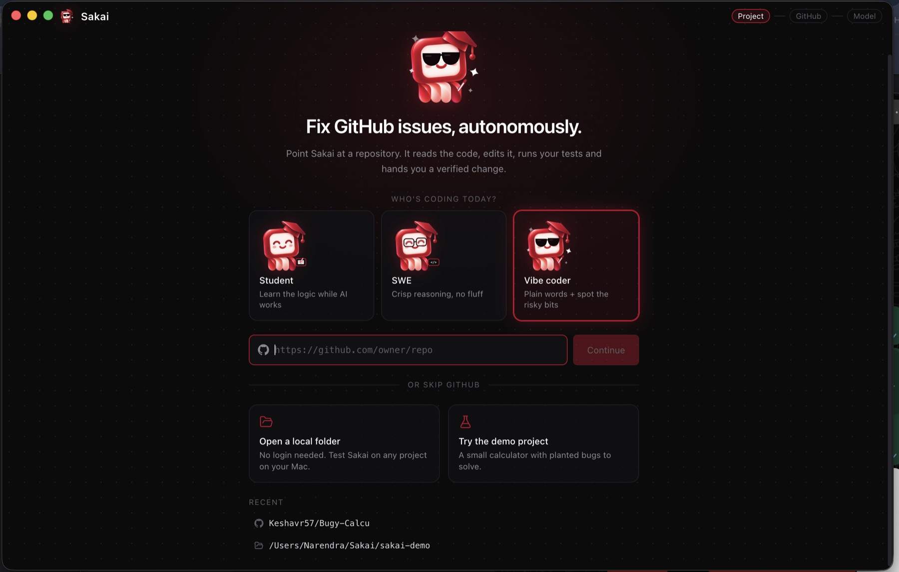
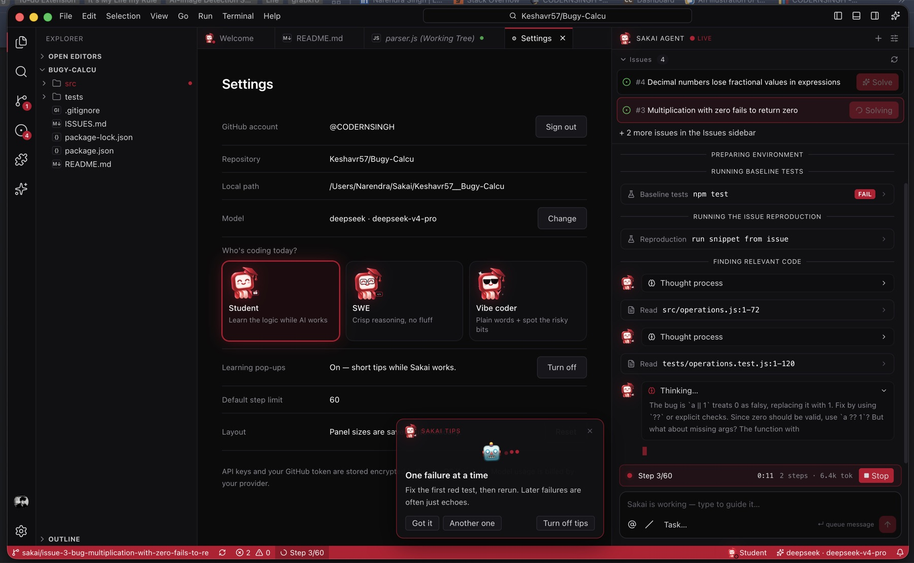
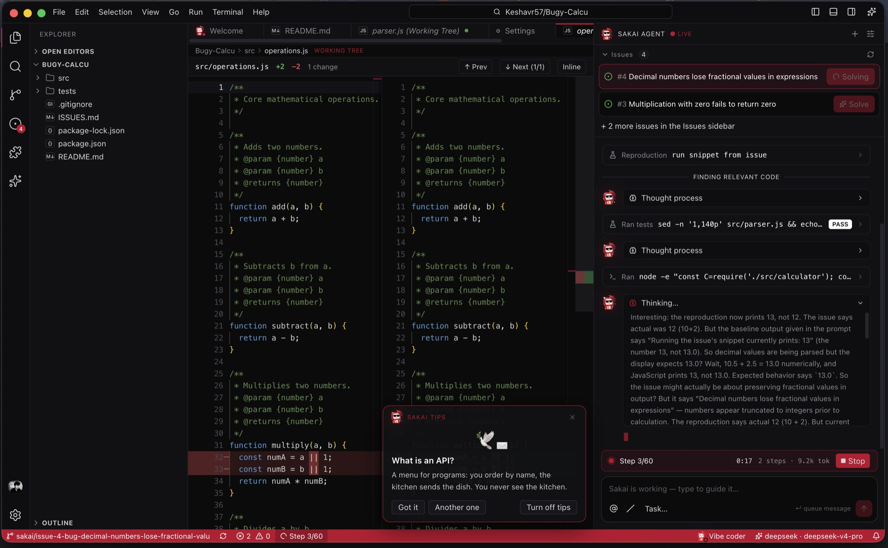
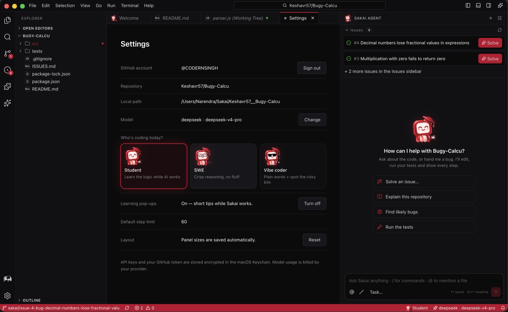
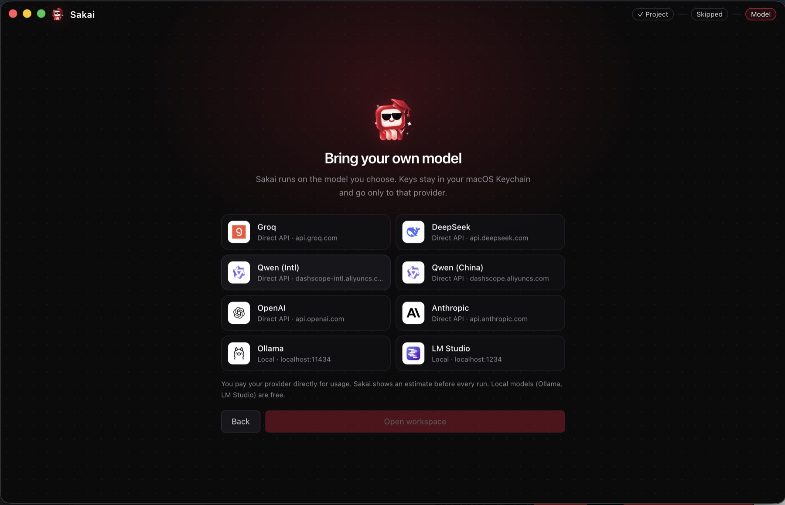
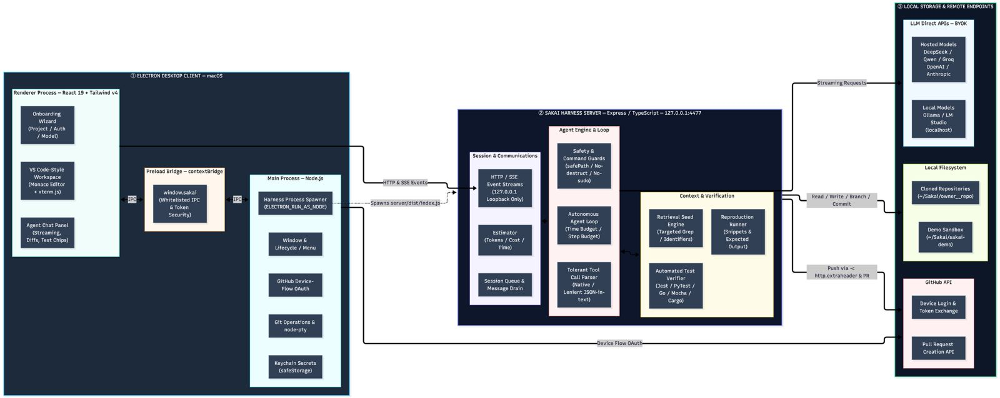

<p align="center">
  <picture>
    <source media="(prefers-color-scheme: dark)" srcset="assets/black_bg_logo.jpeg">
    
  </picture>
</p>

<h1 align="center">Sakai IDE</h1>

<p align="center"><b>Fix GitHub issues, autonomously.</b><br>
A VS Code-style desktop IDE wrapped around an autonomous coding agent that reproduces the bug, edits the code, verifies against your tests, and hands you a reviewed diff.</p>

<p align="center">
  
  
  
  
  
</p>

<p align="center">
  
</p>

## TL;DR (30 seconds)

**Evaluators: four lines, nothing else to configure.**

```bash
git clone https://github.com/CODERNSINGH/super-mario-LCC-DEVclub.git && cd super-mario-LCC-DEVclub
export AI_API_KEY="<PROVIDED_API_KEY>"
make setup
make run
```

Then paste a repository link (try `https://github.com/Keshavr57/Bugy-Calcu`), choose **Continue without signing in**, click **Solve** on an issue. Credentials are read only from the environment and are never stored in the repo.

**Other ways in:** [download the macOS app](#b-download-the-app-macos-apple-silicon) · [build it yourself](#c-build-the-app-yourself) · [headless `make solve`](#headless-mode-make-solve)

---

## Contents

[What it does](#what-it-does) · [Run it](#run-it) · [First-run guide](#first-run-guide) · [Feature highlights](#feature-highlights) · [Headless mode](#headless-mode-make-solve) · [Architecture](#architecture) · [Security and privacy](#security-and-privacy) · [Project layout](#project-layout) · [Tech stack](#tech-stack) · [Roadmap](#roadmap) · [Contributing](#contributing) · [FAQ](#faq)

## What it does

Give Sakai a repository (GitHub URL or local folder). Pick an issue from the list (top issues appear with a one-click **Solve** button) or just chat. Then the agent:

1. installs dependencies and runs the **baseline tests**;
2. **reproduces** the issue from the snippet in it;
3. **retrieves** the relevant code (targeted search, not "read the whole repo");
4. **edits** with tools (`replace`, `replace_lines`, `replace_function`, `search`, `read_file`, `bash`, `revert`, ...);
5. **auto-verifies after every edit** against the baseline: fixed / still failing (pre-existing) / newly broken;
6. **finishes by itself** once the fix is verified;
7. shows a **side-by-side green/red diff**, then you choose **Create PR** (GitHub) or **Commit** locally.

Along the way:

- **Live streaming chat.** Watch thinking, tool cards and test results as they happen, and talk to the AI mid-run.
- **Profile modes.** Student, SWE or Vibe coder, each with its own mascot and tone.
- **Learning pop-ups.** Short tips that fade in while the AI works, plus a "learn from this fix" card with a quick quiz when it is done.
- **Works without GitHub.** Choose "Skip for now", then use a local folder or the built-in demo project (4 planted bugs). Public repos work without any login.

## Run it

Pick one. **A is the evaluator path.**

### A. Evaluator / clone-and-run (Makefile)

Requirements: macOS, **Node.js >= 20**, **git**. (`make setup` checks both and tells you what is missing.)



**1. Clone**

```bash
git clone https://github.com/CODERNSINGH/super-mario-LCC-DEVclub.git
cd super-mario-LCC-DEVclub
```

**2. Provide the API key** (supplied at runtime, never committed)

```bash
export AI_API_KEY="<PROVIDED_API_KEY>"
```

**3. Set up** (checks Node >= 20 and git, installs dependencies, builds the harness)

```bash
make setup
```

You should see the checks pass, `npm install` run, and the harness build finish without errors.

**4. Run**

```bash
make run
```

The Sakai IDE desktop window opens, already connected to the model from `AI_API_KEY`. **The model step is skipped automatically.** Now:

1. Pick a profile, paste a repository link, e.g. `https://github.com/Keshavr57/Bugy-Calcu`.
2. Public repos need no login: click **Continue without signing in** on the GitHub step.
3. The workspace opens. Click **Solve** on an issue (or type a task in the chat) and watch it work.

**5. Test and clean**

```bash
make test        # 40+ unit tests + type-checks
make clean       # removes generated artefacts
make distclean   # also removes node_modules
make help        # lists every target
```

> **Credentials.** `AI_API_KEY` (and any other secret) is read **only from your environment**. Nothing is written to the repository, and the app build does not read `.env` files.

#### All Makefile targets

| Target | What it does |
|---|---|
| `make help` | List targets and environment variables |
| `make setup` | Check Node >= 20 and git, install dependencies, build the harness |
| `make run` | Launch Sakai IDE (desktop app) connected to the model from `AI_API_KEY` |
| `make test` | Unit tests (40+) and type-checks |
| `make solve` | Headless terminal mode, see [below](#headless-mode-make-solve) |
| `make dmg` | Build the macOS installer locally |
| `make install-app` | Build and install Sakai IDE into `/Applications` |
| `make clean` / `make distclean` | Remove generated artefacts / also `node_modules` |

#### Model configuration

The provider and model are defined in [`app/src/main/llm.ts`](app/src/main/llm.ts) and can be overridden with environment variables:

| Variable | Purpose | Default |
|---|---|---|
| `AI_API_KEY` | API key for the chosen provider (**required to solve**) | none |
| `AI_PROVIDER` | `deepseek` \| `qwen` \| `qwen-cn` \| `groq` \| `openai` \| `anthropic` | `deepseek` |
| `AI_MODEL` | Model name | `deepseek-v4-pro` (deepseek), `qwen3.8-max` (qwen) |
| `AI_BASE_URL` | Optional custom endpoint | provider default |
| `GITHUB_TOKEN` | Optional, for headless private repos and PRs | none |

Example: `AI_PROVIDER=qwen AI_MODEL=qwen3.8-max AI_API_KEY=... make run`

### B. Download the app (macOS, Apple Silicon)

**One line** (downloads the DMG from the latest GitHub Release, installs Sakai IDE into `/Applications`, clears the quarantine flag so Gatekeeper does not interfere, and opens it):

```bash
curl -fsSL https://raw.githubusercontent.com/CODERNSINGH/super-mario-LCC-DEVclub/main/install.sh | bash
```

**Manual:** download `Sakai-IDE-<version>-arm64.dmg` from the [latest release](https://github.com/CODERNSINGH/super-mario-LCC-DEVclub/releases/latest), open it, drag **Sakai IDE** to **Applications**.

The app is **not notarized yet**, so on another Mac the first launch may say it "can't be opened". macOS 15 (Sequoia) removed the right-click **Open** shortcut. Use one of:

- **System Settings > Privacy & Security** > scroll down > **Open Anyway**; or
- `xattr -cr "/Applications/Sakai IDE.app"` and open it again; or
- use the one-line installer above, or [option C](#c-build-the-app-yourself).

Then follow the [first-run guide](#first-run-guide). In the app you choose the model and paste your own key.

<details>
<summary><b>Troubleshooting</b></summary>

| Symptom | Fix |
|---|---|
| "Sakai IDE can't be opened" / "cannot verify the developer" | Privacy & Security > **Open Anyway**, or `xattr -cr "/Applications/Sakai IDE.app"` |
| Right-click > Open does nothing on macOS 15 | Expected; use one of the fixes above |
| `make setup` says Node is too old / missing | Install Node 20+ (for example `brew install node` or [nodejs.org](https://nodejs.org)) |
| `make setup` says git is missing | `xcode-select --install` |
| `make run` opens the app but the model is not connected | Check `echo $AI_API_KEY` in the same terminal; export it again and re-run |
| Solve fails with an auth / 401 error | Wrong key for the chosen `AI_PROVIDER`; set both together |
| GitHub sign-in code expired | Click **Connect GitHub** again, or choose **Continue without signing in** / **Skip for now** |
| Private repo will not clone | Sign in to GitHub in the app (or set `GITHUB_TOKEN` for `make solve`) |
| Apple Intel Mac | The prebuilt DMG is arm64 only; use option A or C (they build for your machine) |
| Tests fail before any edit | Normal: Sakai records a baseline and only cares about regressions and the issue's own reproduction |
| Anything stuck | `make clean && make setup` (or `make distclean` for a full reset) |

</details>

### C. Build the app yourself

No security prompt, because you built it locally.

```bash
make install-app   # builds locally and installs Sakai IDE into /Applications
make dmg           # or: build the .dmg installer only
```

## First-run guide

<p align="center">
  
</p>

1. **Profile.** Who is coding today: Student (learn the logic while the AI works), SWE (crisp reasoning, no fluff) or Vibe coder (plain words, risky bits flagged). Changeable later in Settings.
2. **Repository.** Paste `https://github.com/owner/repo`, open a local folder, or try the demo project (`~/Sakai/sakai-demo`, 4 planted bugs). Recent projects are listed.
3. **GitHub** (skippable). Approve a device code at github.com/login/device to enable private repos, issue lists and PRs. Or **Skip for now** / **Continue without signing in**. The other integrations (AWS, GCP, Azure, GitLab, Bitbucket, Jira, Linear, Sentry) are shown as *coming soon*.
4. **Model.** Pick a provider and paste your key (skipped automatically under `make run`).
5. **Workspace.** The repo is cloned (or reused), open issues are listed in the agent panel.
6. **Solve.** Click **Solve** on an issue, or type a task. Review the diff, then **Create pull request**, **Commit only**, or **Discard**.

### Keyboard shortcuts

| Shortcut | Action |
|---|---|
| `⌘K` / `⇧⌘P` | Command palette |
| `⌘P` | Quick open file |
| `⌘S` | Save file |
| `` ⌘` `` | Toggle terminal |
| `⌘J` | Toggle bottom panel |
| `⌘B` | Toggle sidebar |

Chat slash commands: `/solve`, `/explain`, `/tests`, `/stop`, `/clear`; `@file` mentions a file.

## Feature highlights

### Live agent: every step visible, and you can steer it

<p align="center"></p>

The agent panel streams phases (preparing, baseline tests, reproduction, finding code), collapsible **thought process**, tool cards (`Read src/operations.js:1-72`, `Ran tests ... PASS/FAIL`), a step counter with tokens and time, and a **Stop** button. The composer stays live ("Sakai is working, type to guide it"), so you can message the AI mid-run. Fading **Sakai Tips** teach a concept while it works.

### Edits shown as they happen

<p align="center"></p>

Each edit opens a diff tab that refreshes live: removed lines in red, added lines in green, with `+N -M` counts in the tab and in Source Control.

### Verified change, one click to ship

<p align="center"></p>

The finished fix appears as a side-by-side diff (`parseInt(token, 10)` to `parseFloat(token)` in the shot). **Create pull request** pushes the branch and opens a PR on GitHub, **Commit only** commits locally, **Discard** reverts. The **learn from this fix** card adds a short quiz and explanation.

### Profiles and mascots

<p align="center"></p>

Student, SWE and Vibe coder change the mascot, tone and how much explanation you get. Settings also show the connected account, repository, local path, model, learning pop-ups toggle and the default step limit (60).

### Bring your own model

<p align="center"></p>

Direct provider APIs only, no gateway in between. Text-only models.

| Provider | Endpoint / notes |
|---|---|
| DeepSeek | `api.deepseek.com` (`deepseek-v4-pro`, `deepseek-flash`) |
| Qwen | Alibaba Cloud Model Studio, international and China regions (`qwen3.8-max` and others) |
| Groq | `api.groq.com` (`openai/gpt-oss-120b`) |
| OpenAI / Anthropic | `api.openai.com` / `api.anthropic.com` |
| Ollama / LM Studio | Local (`localhost:11434` / `localhost:1234`), free |

You pay your provider directly; Sakai shows an estimate before each run. Keys are stored in the macOS Keychain (app) and never committed.

### Also in the IDE

VS Code-style workspace with Monaco editor, tabs and breadcrumbs, Explorer, Search, Source Control, Issues, integrated terminal (xterm), Problems/Output panels, command palette, editable files, and a dark theme in the Sakai brand color `#BC002D`.

## Headless mode (`make solve`)

No GUI needed. Prints live logs, verifies tests, then prints the diff. Requires `AI_API_KEY`.

```bash
export AI_API_KEY="<PROVIDED_API_KEY>"
make solve REPO=https://github.com/Keshavr57/Bugy-Calcu ISSUE=1
make solve REPO=https://github.com/owner/repo TASK="describe the bug"
```

Set `GITHUB_TOKEN` for private repos or PRs. Provider and model follow the [environment variables above](#model-configuration).

## Architecture

<p align="center"></p>

Three parts:

1. **Electron desktop client (macOS).** The renderer (React 19 + Tailwind v4) holds the onboarding wizard, the VS Code-style workspace (Monaco, xterm.js) and the agent chat panel. A preload bridge exposes only a whitelisted `window.sakai` API over IPC. The main process spawns the harness, runs GitHub Device-Flow OAuth, git operations and terminals (`node-pty`), and keeps secrets in the Keychain (`safeStorage`).
2. **Sakai harness server (Express / TypeScript, `127.0.0.1` only).** Session and SSE event streams, an estimator (tokens, cost, time), and the agent engine: safety and command guards, the autonomous loop with a step budget, and a tolerant tool-call parser (native function calling or JSON-in-text). Context and verification: a retrieval seed (targeted grep of identifiers), a reproduction runner (issue snippet and expected output), and an automated test verifier (Jest, PyTest, Go, Mocha, Cargo).
3. **Local storage and remote endpoints.** Direct LLM APIs (hosted or local Ollama / LM Studio), cloned repositories under `~/Sakai/`, and the GitHub API for device login and pull requests. The token is passed to git per command, never stored in remotes.

**Agent loop:** prepare, install deps, baseline tests, reproduce issue, retrieval seed, then loop (drain queued user messages, call the model, parse the tool call, guard, execute, auto-verify against the baseline). A finish gate requires that tests ran, nothing newly broke, and the diff is non-empty, and forces a self-review of `git diff`.

## Security and privacy

| Area | Behavior |
|---|---|
| Network | Harness server binds to `127.0.0.1` only |
| Files | All file access is confined to the repository root (path-traversal rejected) |
| Command guard | No dependency changes, no git state changes (commit / push / reset / clean / stash / rebase), no `sudo`, no destructive or `curl \| sh` commands |
| Protected files | `package.json`, lockfiles and build config cannot be edited by the agent |
| Secrets | API keys and GitHub token live in the macOS Keychain (app) or the environment (`make`); never committed |
| Data flow | Your code goes only to the model provider you chose; no gateway or proxy |
| Renderer | `contextIsolation` on, `nodeIntegration` off, whitelisted IPC only |
| Runaway control | No whole-run time limit, but hang guards: a command runs up to 8 min, a silent model 5 min (stalled step is restarted automatically), step budget 60 (adjustable) |

## Project layout

| Path | Purpose |
|---|---|
| `app/` | Electron desktop client (electron-vite, React 19, Tailwind v4) |
| `server/` | Agent harness, tools, git / PR API (TypeScript, ESM) |
| `web/` | Landing page (Vite + React + Tailwind) |
| `scripts/` | Helper scripts: `check-config.mjs` (release guard), `list-issues.sh` (lists a repo's open issues) |
| `assets/` | Logos, provider / integration images, app icon |
| `docs/` | Screenshots and test issues ([TEST-ISSUES.md](docs/TEST-ISSUES.md)) |
| `Makefile` | `setup`, `run`, `test`, `solve`, `dmg`, `install-app`, `clean` |
| `install.sh` | One-line macOS installer |

## Tech stack

Electron, React 19, Tailwind CSS v4, Monaco editor, xterm.js, node-pty, Node.js + Express, TypeScript, Server-Sent Events, electron-builder (DMG).

## Roadmap

- [ ] Apple notarization (removes the first-launch prompt)
- [ ] Intel (x64) build
- [ ] GitHub Actions log fixing (fix failing CI from its logs)
- [ ] More integrations, coming soon: AWS, GCP, Azure, GitLab, Bitbucket, Jira, Linear, Sentry
- [ ] Bundled git, auto-update

## Contributing

```bash
npm install
npm run dev          # builds the server and launches the desktop app
npm test -w server   # harness unit tests
npm run dist         # build the .dmg (app/release)
```

Test repository: [Keshavr57/Bugy-Calcu](https://github.com/Keshavr57/Bugy-Calcu) (4 bugs: subtract operand order, operator precedence, multiplication by zero, decimal handling). See [docs/TEST-ISSUES.md](docs/TEST-ISSUES.md). Issues and PRs are welcome.

## FAQ

**Do I need a GitHub account?** No. Public repos work via "Continue without signing in"; or use a local folder or the demo project. You need GitHub sign-in only for private repos and for opening PRs.

**Which models work?** Any text-only model from DeepSeek, Qwen, Groq, OpenAI, Anthropic, or local Ollama / LM Studio. Very small local models (about 3B and under) cannot follow the tool protocol reliably; use a coder-class model.

**Where does my code go?** Only to the model provider you selected (or nowhere, with a local model). There is no Sakai server or gateway.

**Where are my keys stored?** In the macOS Keychain (app), or read from your environment (`make`). Never in the repo.

**Does it change my dependencies or git history?** No. The command guard blocks dependency changes and git state changes; commits happen only when you click Commit or Create PR.

**What if a run gets stuck?** Click **Stop**, or just type a message to guide it. Hang guards restart stalled steps automatically.

**Windows / Linux / Intel Mac?** Not in the prebuilt release yet. `make setup && make run` builds for your machine, but the app is developed and tested on macOS.

**Is it notarized?** Not yet; see the [first-launch fix](#b-download-the-app-macos-apple-silicon).
